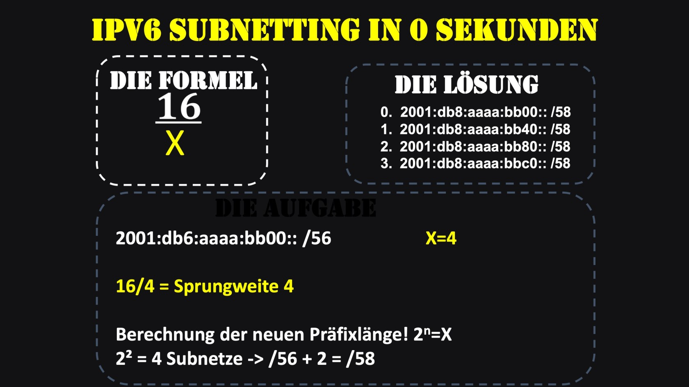
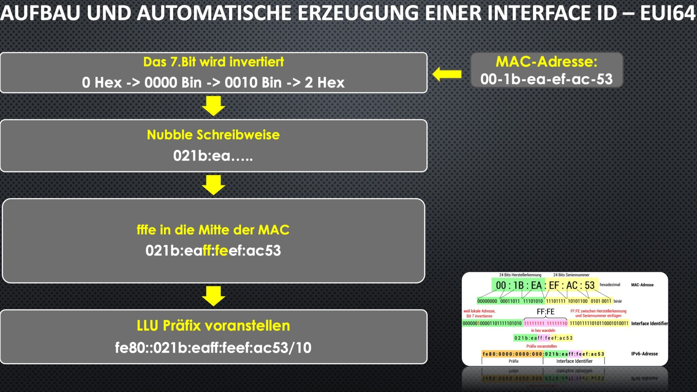
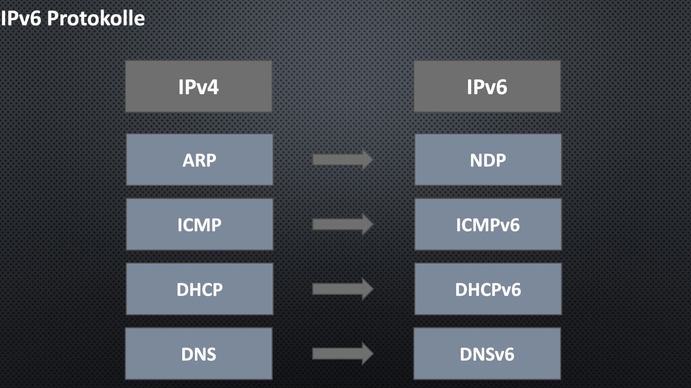
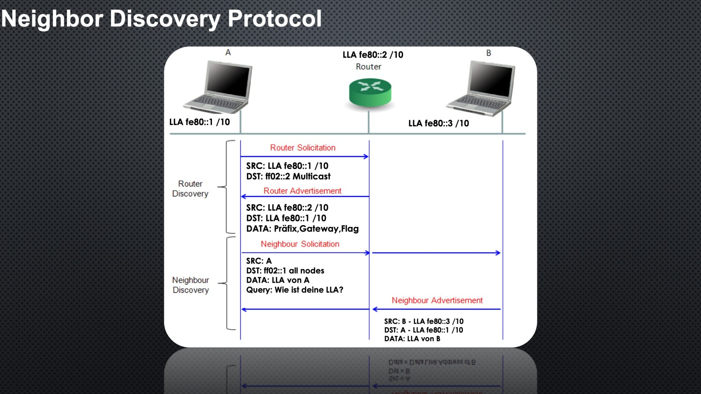

### IPv6 Subnet in 0 sekuden
1. SW = 16/(anzahl der benötigten subnetze(2er potenz))
2. Präfixlänge = Anzahl der Subnetze 

## IPv6 Suffix erstellung

### SLAC (Stateless Address Autoconfiguration)
3 Varianten zur automatischen Bildung einer interface-ID
- EUI-64-Format: Interface_ID mit Hilfe der MAC-Addresse
- Privacy Extensions: Erestellt eine garantiert eindeutige Interface-ID, die keine Rückschlüsse auf die MAC-Addresse des knotens zulässt.
- Random Identifier: Windows Systeme erstellemn einmalig eine zufällige Interface-ID

#### EUI64
- beim 7. Bit einfach 2 Zahlen dazu addieren (also die 2.hex zahl + 2)

#### Privacy Extensions
- Wechselt automatisch die Addresse
- zum abschalten, muss man mit admin rechte einen power shell befehlt ausführen

Frage: Bei welchen Geräten und warum, muss man die Privacy Extension deaktivieren?
- Damit der Server eine Statische IPv6 Addresse beim Server eingerictet werden lann
- sonst erhält der Server beim neustart eine neue adresse
- clients müssen daher die server-addresse jeweils neu ermitteln

## IPv6 Protokolle

#### IPv6 NDP (Stateless) via SLAC
- Neighbour Discovery Protocol
1. Router Solicitation, Multicast addresse: ff02::2
2. Router Advertisement
3. Neighbour Solicitation, Multicast addresse: ff02:1
4. Neighbor Advertisement

### DHCPv6
- statt DORA

### IPv6 Traceanalyse