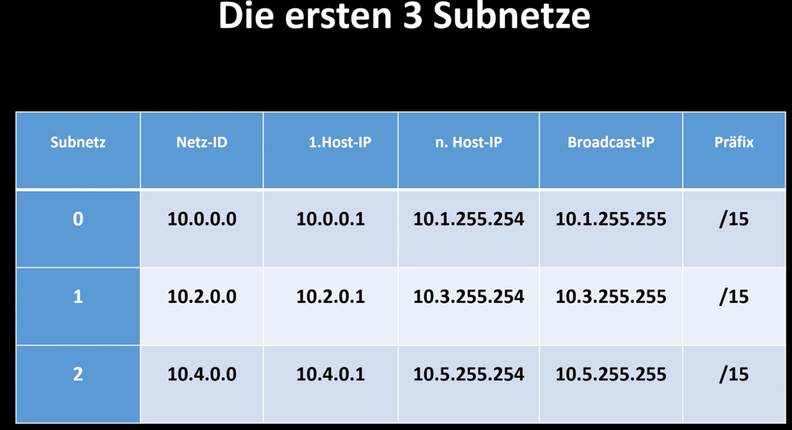

##### Infos:

- Lehrer: Tillman
- [onedrive tillmann](https://tinyurl.com/compudocs)
  - Alle Skripte und Videos von Kursen

- Taschenrechner kann alles und einige hilfsfunktionen, siehe Bild

## Subnetting

### Normales Subnetting

Eiten entwickelte Tillmann methode: 

1. 192.168.0.0/24
2. 2hoch n >= 4
3. - welche nächsthöhere Zahl wird benötigt um die gewünschte Anzahl(n) zu erreichen

Aufgabe: subnetz in 56 teile aufteilen

- 2n6 = 64 >=56 - n = 6 = sprungweite 4 (siehe spruingweitenmatrix)

##### Subnetze im 3. Oktet berechnen

##### Subnetze im 2. Oktet berechnen

##### Subnetze Tabelen ausfüllen

- Tabellen Spaltenweise ausfüllen

**Workflow zum Tabellen ausfüllen:**

1. NetzID = 0 in 4er schritten
2. 1. Host-IP = NetziD+1
3. Broadcast IP = die NetzID der nächsten Zeile -1
4. letzte Host IP = Broadcasd IP-1
5. 

### Extended Subnetting

- wenn bereits subnetze implementiert wurden und analysiert werden müssen

> **Präfix in subnetzmaske umwandeln:** /27 wir haben 3 bit übrig = 128 + 64 + 32 = 224 + 16 +

> **Hostformel:** Anzahl der Hosts = 2 hoch s -2  
> (s = suffix)  
> 

> **Präfix ermitteln, anhand der Host IP Adresse** 1. Sprungweite ermitteln  
> 2\. Oktett dazu rechnen = präfix
>
> 
>
> 

##### Netz Adressen aufschreiben anhand einer IP+präfix

-

### IPV6 Subnetting

### Oktettübergreifendes Subnetting

- nicht ein Oktet sondern mehrere 
- Rechentechnik
  - um die Sprungweite zu berechnen: nicht oktetübergreifend abziehend, sonder das nächsthöhere oktet abziehen

### Supernetting

subnetting zurück

- mehrere netze zusammenfassen

1. erste netzid nehmen : 117.22.176.0/23
2. 2 hoch n => 4 -> n=2 -> um 4 netze zusammenzufassen, bnrauche ich 2 bit
3. wenn wert n vom präfix abziehen = /23 - 2

**überprüfen:**

1. nächste standartpräfix abziehen (8/16/24)
2. die sprungweite aus dem differenzwert abziehen
3. den werz zum oktett hinzurechnen und ich habe die IP aus dem nächsten Netz

### VLSM (neu seit Winter 2021/22)

- Variable Length Subnet Mask
- Subnetting mit Variabler Präfixlänge

Regeln:

- ## immer mit der site beginnen, mit den meisten hosts

1. hostformel nutzen zum berechnen der Größe des 1. netzes
   - 2 hoch 2 =>100 suffix = 7 bit (präfix = 32 - suffix = 25 bit)
2. sprungweite berechnen - /25.24 = n=1 = sw 128

   192.168.0.0/24 in 56

2hoch n >= 56 n=6

sw=4
