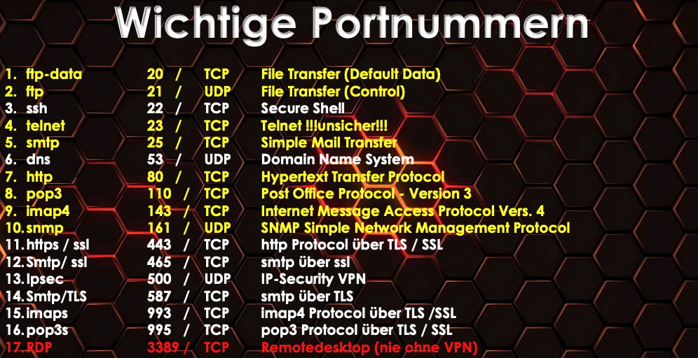

## Firewall Arten
### Packet Filter

### Stateful Packet Instection

- erkennt ob ein client die Verbindung aufbaut
- akzeptiert nur Packete die von innen angefordert wurden

Filtert immer auf 2 Arten:

- ACL
- ist im State table vorhanden

**Verbindungsaufbau** immer von Port &gt;1023  -&gt; wird in **State Table** protokoliert

gelb unsicher; weiss sicher; rot ganz unsicher 

### Application Level Firewall

- Die Application Level Proxy Technologie ist die umfassendste und genaueste Firewall Technologie. Hier wird jedes Datenbacket - soweit möglich und sinnvoll - bis auf die oberste Ebene des OSI Modells untersucht und einem Webserver **absichern, verschleiern oder beschleunigen**. 

### Proxy

- Ein Proxy Server ist ein Vermittler in enem Netzwerk, der Anfragen engenm und sie stellver‡retend weterleitet. Mit Hilfe des Proxy Servers lasst sich die Kommunikation zwischen einem Tokalen Client

#### Hauptaufgabe eines Proxys:

- Stellvertreterfunktion
- Filterfunktion (Blacklist / Whitelist / Content)
  - Blacklist: "alle Websiten sind erlaubt, bis auf die die in der Blacklist stehen"
- Nutzer AUthentifizierung -&gt; AAA -&gt; RADIUS
  - RADIUS(AAA - Authentication, Authorization, Accounting)
- Caching

### Next Generation Firewall

- Modulare Firewall
  - Komponenten können hinzugefügt werden

#### Komponenten

- Gateway AntiVirus
- Content Filterung
- IDS - IPS
  - IDS - intrusion Detection System. Firewall Admin entscheidet was mit dem unbekannten Traffic passieren soll
  - IPS - Intrusion Prevention System. Wenn nichts passiert entscheidet das System nach einiger Zeit selbst was damit passieren soll.
- AntiSpam
- VPN Gateway
- RADIUS
- VoIP - Nur bei Modernen Firewalls (Früher wurde Session Border Controller)

### DMZ

- Zone zwischen Internet und Intanet
- hier stehen alle Server die von Außen/Internet erreicht werden müssen

### Access Controll List (ACL)

#### Innere Firewall ACL

##### Äußere Firewall

[Firewalls2021.pdf](Firewalls2021.pdf)
