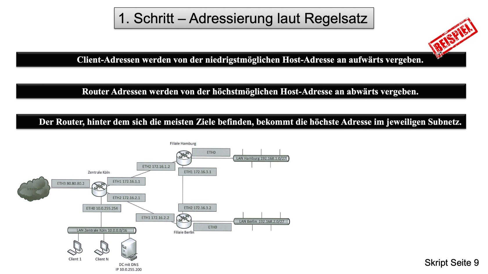
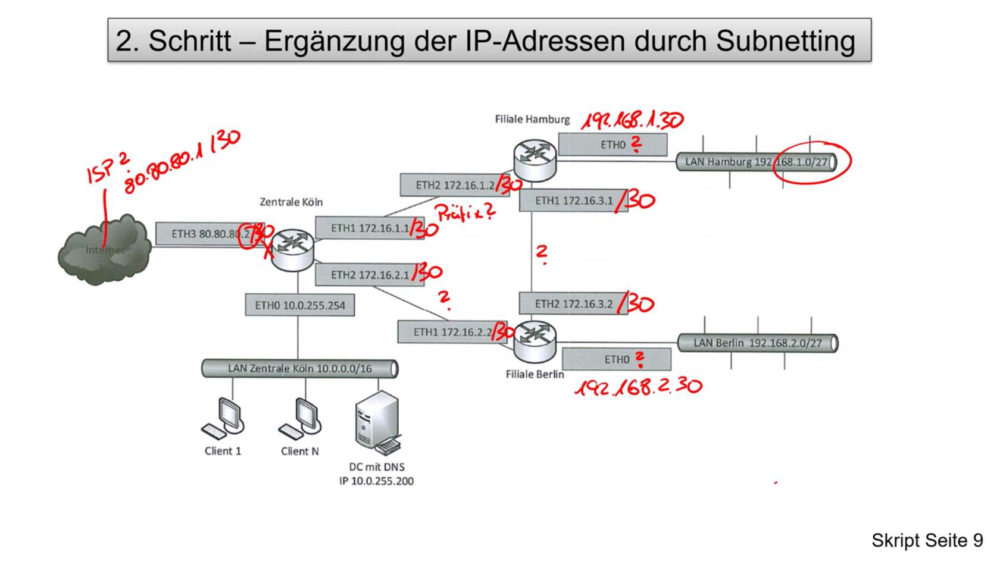
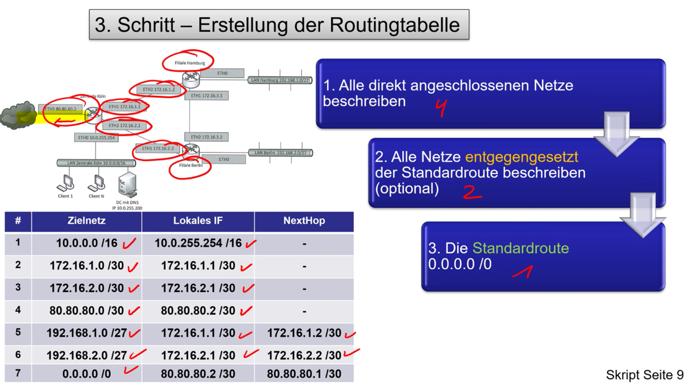
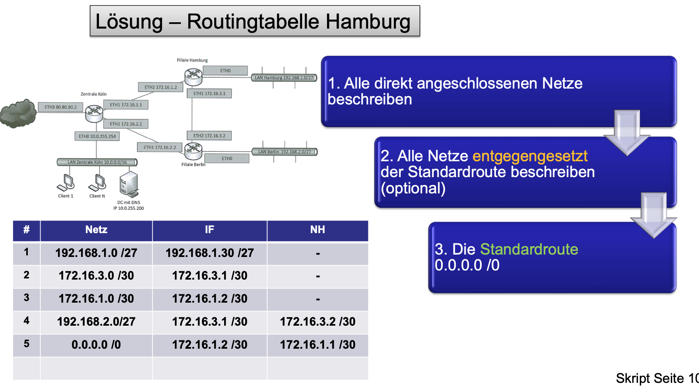

## Statisches Routing

### 3 Schitte des Routings

#### Schritt 1 - Addressierung laut Regelsatz

> Regelsatz Addressierung:
>
> - Client-Addressen werden von der niedrigstmöglichen Host-Adresse an aufwärts vergeben
> - Router Adressen werden von der höchstmöglichen Host-Adresse an abwärts vergbeben
> - Der Router, hinter dem sich die meisten Ziele befinden, bekommt die höchste Adresse im jeweilgen Subnetz

#### Schritt 2 - Ergänzung der IP-Addressen durch Subnetting

#### Schritt 3 - Erstellung der Routingtabelle

## Dynamische Routingprotokolle
> Beim dynamischen Routing tauschen die Router untreinander die Routinginformationn aus und beeche daraus die Routingtabellen. Beim Ausfall einer Route kann durch das Routingprotokoll eine Ersatzroute automatisch eingesetzt werden.

### RIP & OSPF

## IHK Fragen zu Routing

- Erstellen Sie eine Routing Tabelle
- finden Sie den Fehler in einer vorhandenen Routing Tabelle
- Tabelle ergänzen
