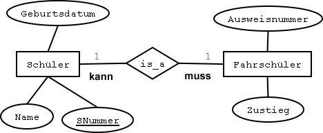
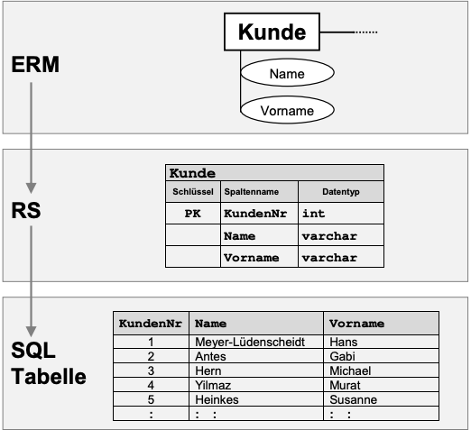
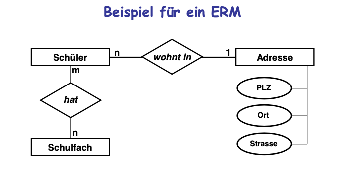
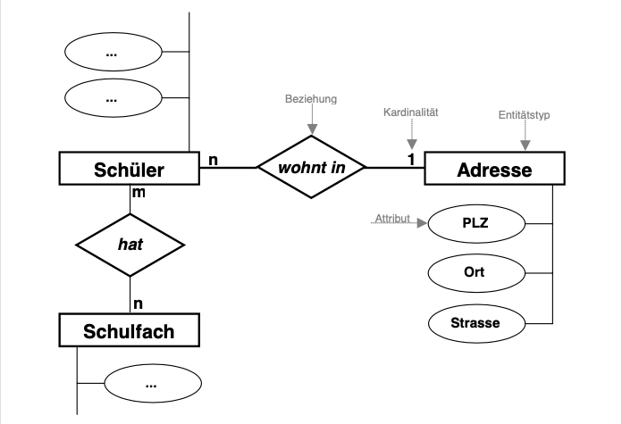

## DBMS Grundlagen

- Ende der 60er Jahre von Edgar J Codd entwickelt
- Das ERM (Entity Relationship Model) erfasst Beziehungen zwischen realen Entitäten
  - Primärschlüßel/Fremdschlüssel

Geben Sie die Anforderungen &amp; Bedingungen an die ein DBS erfüllen muss ! Welche davon sind zudem gesetzlich vorgeschrieben ?

Gesetzlich wird **Datensicherheit** für Datenbanken gefordert

**Datensicherheit**: Die gesetzlich geforderte Datensicherheit umfasst:

- die Verfügbarkeit von Daten
- die Konsistenz von Daten

1. **Verfügbarkeit**: ist die Möglichkeit alle Daten eingeben, ändern, löschen und abfragen zu können. Erst wenn diese Möglichkeiten gegeben sind spricht man von einer Datenbank.
2. **Konsistenz &amp; Integrität:** Eine Datenbank ist integer oder konsistent, falls sie Widerspruchsfreiheit garantiert. D.h. alle gespeicherten oder abgefragten Daten sind eindeutig und fehlerfrei.

Ebenfalls Mustitasking/Multiuser betrieb sind voraussetzungen für eine funktionierende Datenbank.

Eigenschaften von Konsistenz, Persistenz, Integrität

- Widerspruchsfreiheit - Konsistenz, Ist bei dem kein Widerspruch entsteht, also eine kein Ausdruck die nicht gleichzeitig negiert werden kann.
- Dauerhafte Speicherung - Persistenz, alles womit man Informationen sichern kann (Bsp. Papier, Bücher, USB-Stick aber auch die Speicherung aller Tonaufnahmen.)
- Gültigkeit, Richtigkeit - Integrität, beruht nicht auf Wahrheit, sondern auf logische Form.

# DB Struktur Planen

## ERM

- Entität in Einzahl !!
- ohne Attribute (wegradieren)
- Attribute nur bei Bedarf in (n:m) Zwischentabelle
- mögliche Beziehungen (1:1) oder (1:n) oder (n:m)
  

## RS

[

- Tabellename als Überschrift
- RS Aufbau : | Schlüssel | Spaltenname | Datentyp

## Normalformen

1. Normalform: Eine Tabelle ist in der 1.Normalform wenn alle Felddaten atomar sind.
   - Atomar : heißt, dass jedes Feld jeweils nur eine einzelne Information (Aussage) beinhaltet die nicht in weitere (sinnvolle) Teilbereiche aufgespalten werden kann. Nicht atomar sind also Felder mit zusammengesetzten Daten oder mit Wiederholungsgruppen bzw. Aufzählungen. Diese Felder müssen zerlegt werden.
2. Normalform (NF2): Die Tabellen müssen in der ersten Normalform sein und zusätzlich müssen alle Nichtschlüssel-Felder voll funktional vom Primärschlüssel abhängig sein.
3. Normalform (NF3) : Die Tabellen müssen in der zweiten Normalform sein und zusätzlich sollen keine Abhängigkeiten zwischen den Spalten, die nicht den Primärschlüssel bilden, bestehen. [Normalformen Infoblatt](https://bookstack.niclasedge.com/NOR%20D%20Normalformen%20INF.pdf)

### Hauptschlüssel:

- Jede Tabelle hat irgend eine Form von Schlüssel ! (ab NF2)

## ERM Diagram

 

- Keys : PK, FK, (PK)
- Datentypen :
  - INT für ganze Zahlen
  - DECIMAL (n,m) für Festkommazahlen (7,3) = 123.567 n = ges. Anzahl Stellen, m = Nachkommastellen
  - FLOAT für Gleitkommazahlen --&gt; Kommazeichen(!)
  - CHAR(n) für Zeichen, n = Länge
  - VARCHAR(n) für Zeichen, n = max. Länge
  - DATE für Datum --&gt; Datumformat(!)
