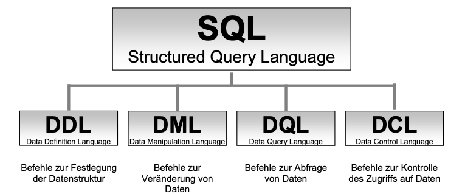
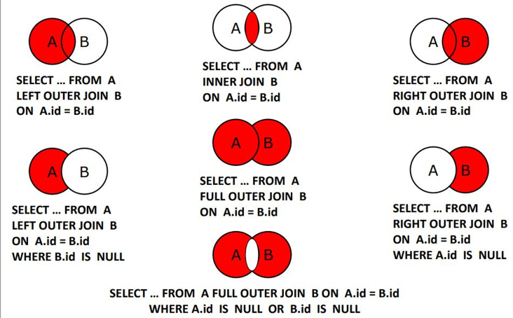
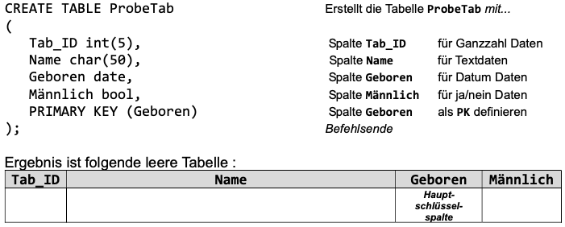
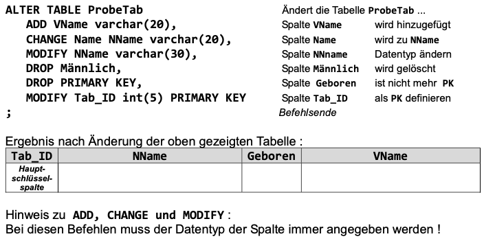

## DDL Skript erstellen:

- Tabelle erstellen (wenn möglich)
- Spalten definieren mit Datentyp
- Schlüssel definieren

## Befehlssyntax:

- Syntaxregeln verstehen
- neue Befehle mit Hilfe von Syntax anwenden

## Abfragen:

- Aggregatfunktionen
- Alle Daten ohne Doppelnennung (DISTINCT)
- Sortierung (ORDER BY)
- Bedingungen, Platzhalter
- AND, OR
- Mathematische Berechnungen

# SQL Syntax

[](image-1652869350424-08-04.png)

## DQL

- **DISTINCT**: `SELECT DISTINCT vorname FROM kunde` - zeigt jeden Vornamen nur 1mal an. Alle anderen Zeilen mit dem selben Namen werden nicht an-gezeigt !
- **ORDER BY**: `...ORDER BY nachname DESC` - sortiert die Datensätze absteigend nach der Spalte Nachnamen.
- **LIMIT**: `...LIMIT 20,13` - zeigt 13 Zeilen der Abfrage an, start bei Zeile 21 `..GROUP BY abteilung, COUNT(mitarbeiter) HAVING COUNT(mitarbeiter)>3` - zeigt nur die Abteilungen und die Anzahl ihrer Mitarbeiter an, die mehr als drei Mit- arbeiter haben. **WHERE:**
- **Vergleichsoperatoren**: &gt; , &lt; , = , &lt;&gt; , &gt;= , &lt;=
- **Bereichsauswahl**: `WHERE gehalt BETWEEN 2500 AND 2900`
- **Elementprüfung**: `WHERE vorname IN ('Jutta', 'Hans', 'Josef')`
- **Logische Operatoren**: AND , OR , NOT
- **NULL Prüfung**: `WHERE nachname IS NULL`
- **LIKE + Wildcards**: `_`steht für ein Zeichen, `%` steht für beliebig viele Zeichen
  - `WHERE name LIKE 'A__'`
- **Skalar Funktion:** berechnen aus jeweils einem Wert bzw. Datensatz eine Ergebniswert. Skalar- oder Einzelzeilenfunktionen werden also verwendet, um für jeden Datensatz einer Abfrage einen Einzelwert zu bearbeiten.
  - lower() Text in Kleinbuchstaben umwandeln
  - upper() Text in Großbuchstaben umwandeln
  - trim() Leerzeichen vor und hinter dem Text entfernen (trimmen)
  - replace() einen Teil des Textes durch einen anderen Teil ersetzen
  - substr() Einen Teil des Textes aus gesamten Text rausschneiden
  - instr() Position eines bestimmten Teils im gesamten Text angeben
  - length() Die Länge eines Textes, also die Anzahl der Zeichen
  - concat() Zwei o. mehr Textteile zu einem Text zusammenfügen
  - ascii() Die ASCII Nr.es ersten Zeichens eines Textes angeben
  - char() Das Zeichen einer bestimmten ASCII Nr anzeigen
- **Aggregatfunktionen**: berechnen, im Genesatz zu Skalar Funktionen, aus mehreren Datensätzen einen Ergebniswert
  - AVG()
  - SUM()
  - COUNT()
- **SUBSELECT**: ist eine Unterabfrage einer SELECT Abfrage und wird immer in Klammern gesetzt
  - `SELECT name, gehalt FROM MaGehalt WHERE gehalt = (SELECT max(gehalt) FROM MaGehalt);`
- **JOIN**:
  [](image-1652869304577-05-29.png)

## DML

**Datensatz erstellen:**

- `INSERT INTO Kunde VALUES (15, ’Meyer’,’Hans’,‘021178935‘,0.1);` alle Spalten
- `INSERT INTO Kunde (KID, Rabatt, KName) VALUES (15,0.1, ’Meyer’);` einzelne Spalten **Daten Ändern:**
- `UPDATE Kunde SET Rabatt=0.2;` alle Zeilen\*1)
  - \*1) Ohne (WHERE) Bedingung werden in alle Zeilen der gleiche Spaltenwert eingetragen
- `UPDATE Kunde SET Rabatt=0.3, VName=‘Hans Josef‘ WHERE KID=15;` mehrere Spalten\*2)
  - \*2) UPDATE kann mehrere Spalten gleichzeitig ändern und mit WHERE dafür einzelne Zeilen auswählen **Daten Löschen**
- `DELETE FROM Kunde WHERE KID > 7 AND KID < 19;`
- `DELETE FROM Kunde WHERE KName = ‘Meyer’;`
- Zum Löschen von Zeilen müssen diese mit einer WHERE Bedingung festgelegt werden !
- Für das Löschen aller Daten einer Tabelle kann nur der Befehl TRUNCATE TABLE verwendet werden (s.u.).

`TRUNCATE TABLE Kunde` Alle Daten einer Tabelle löschen `LOAD DATA` Daten importieren

## DDL

- `CREATE DATABASE TestDB;` Anlegen einer Datenbank
- legt die Datenbank TestDB an `CREATE DATABASE IF NOT EXISTS TestDB;` IF NOT EXISTS verhindert eine Fehlermeldung, wenn TestDB bereits existiert. Sie wird dann nicht angelegt.
- `USE TestDB;` Auswählen einer Datenbank
- `DROP DATABASE TestDB;` Löschen einer Datenbank
- `DROP DATABASE IF EXISTS TestDB;` IF EXISTS verhindert eine Fehlermeldung, falls TestDB nicht existiert Liste der Datenbanken anzeigen SHOW DATABASES; zeigt alle Datenbanken an

**Anlegen einer Tabelle: **

[](image-1652869267145-46-16.png)

**Ändern einer Tabelle: **

[](image-1652869277294-46-43.png)

### Tabelle erstellen mit Primary und foreign Key

```sql
CREATE TABLE Orders (
    OrderID int NOT NULL,
    OrderNumber int NOT NULL,
    PersonID int,
    PRIMARY KEY (OrderID),
    FOREIGN KEY (PersonID) REFERENCES Persons(PersonID)
);


```
