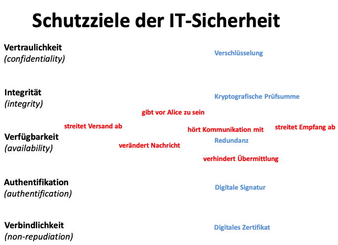

## Schutzziele der IT Sicherheit

-  Unterschied Datenschutz und Datensicherheit
	- Datensicherheit geht es um Daten und deren Sicherheit
    - Datenschutz geht es um Personenbezogene Daten
-  Erläutern Sie die Grundwerte der Informationssicheret:
	- Vertraulichkeit, Integrität, Verfügbarkeit, Authentizität, Verfügbarkeit 
-  Wo ist der Unterschied von Anonymisierung und Pseudonymisierung
   - verscheilert den namen 
   - lässt den Namen weg