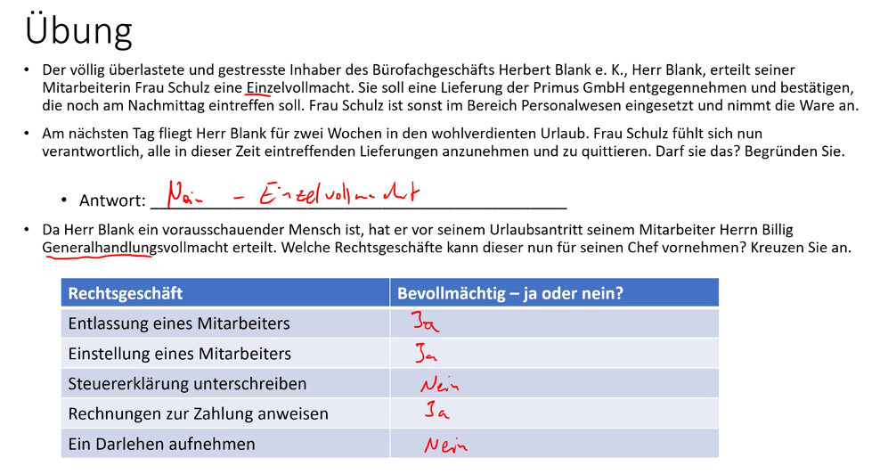

### Rechts- und Geschäftsfähigkeit
### Kaufvertrag
Art und Beschaffenheit
- Stückkauf: individueller gegenstand. gebrauchtes iphone für bestimmten preis
- Gattungskauf: eine art on Gegenstand. Iphone

Aufgabe:
- ba: falschlieferung

- bb: Mangelkrüge oder Reklamation beim Lieferer anmelden
- nacherfüllung verlangen
- ggf: rücktritt / Minderung / Schadensaersatz / Aufwandsersetzung anfordern

- bc: beseitigung des mangels oder Ersatzlieferung 
paperl

### Prokura und Handlungsvollmacht
Aufgabe:

### Unternehmensformen 
### Marktwirtschaft 
#### Preispolitik
#### Marktformen
### Rechnungswesen
### Marketing
### Rechtsgrundlagen

1. kann angefochten werden
2. ist nicht ok, da er nicht eigentümer ist. Nur in Absprache mit Eigentümer.
3. eigentümer ab kauf, besitzer ab lieferung
4. erst mit eintrag in Grundbuch
