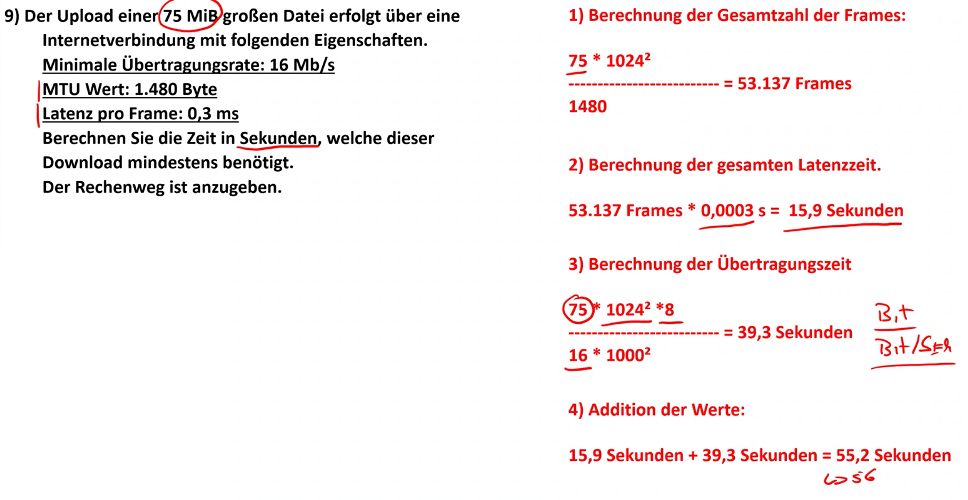
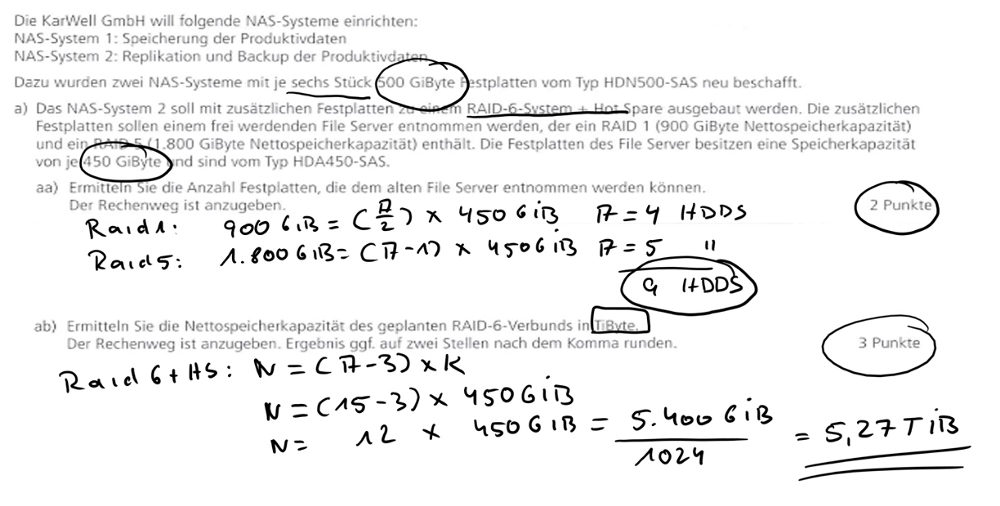
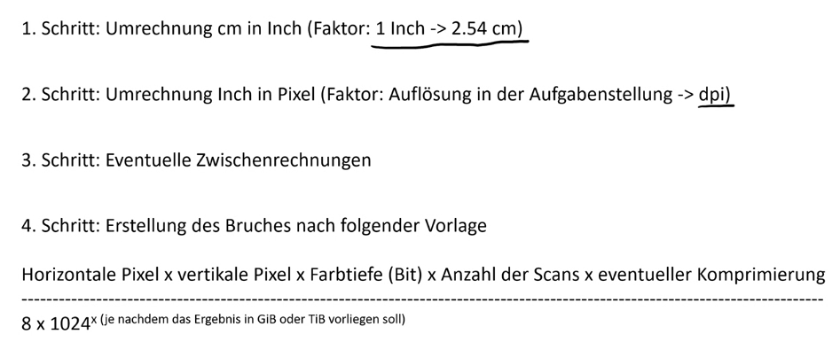
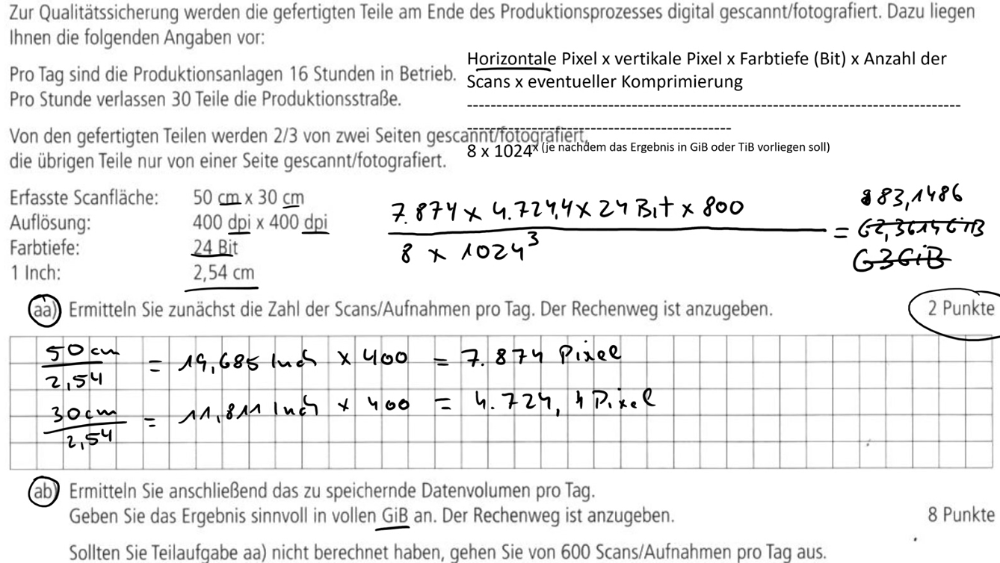
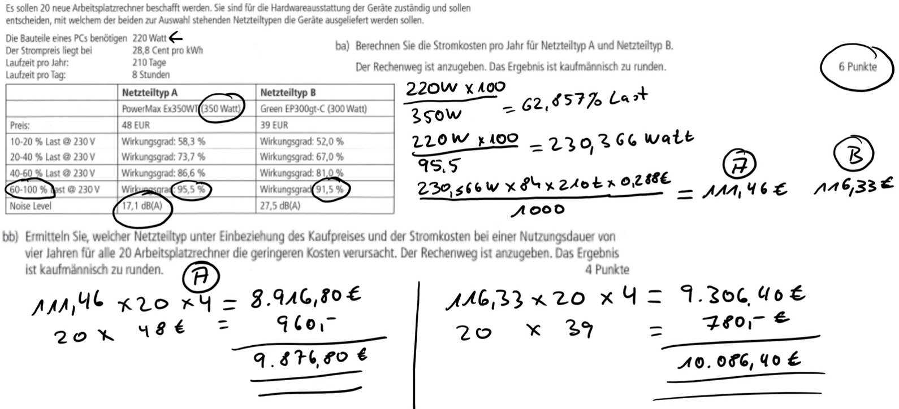

## Datenübertragungs-Formel

1Gb/s *1000 *1000\*1000 /1024/1024/ 8 = 119,20 MiB

700 GiByte x 1024 = 716800 MiB

1. Berechnung der gesamtzahl der Frames: 75MiB *1024 *1024 = 78.643.200 byte / 1480 = 53137 frames
2. Berechnung der Latenzzeit: 53137 frames \* 0,0003 latenz/s = 15,9 sekunden
3. berechnung der Übertragungszeit: 75*1024*1024*8/16*10 = 39,3 sekunden
4. addition der werte: 15,9 sek + 39,3 sek = 55,2 sek

300MiB

1. gesamtzahl der frames

- 300 * 1024*1024 = 314572800 Bytes / 1400 framegröße = 224695 frames

2. benötigte daten:

- frames \* 1518 = 341086793 Bytes

3. berechnung der übertragung in bytes:

- 10Mbit/s übertragung
- 10*1000*1000/8 = bytes pro sekunde = 1250000 B/s

4. benötigte bytes / Bytes/s = 272,86

- 341086793 Bytes / 1250000 B/s = 272,86

## USV-Berechnung

12*25*2 = 1680

350

588000

504000

210\*8 stunden

## RAID-Formeln

1.

- raid 1 900 gb = 4 \* 450gbraid 5 1800 = 1800/450+1 = 5
  == 9 platten

2. 6 -2 -1 = 3\*500
   

## Scan / Foto / Video-Berechnung

### Scan

1. umrechnung ch in inch
2. umrechnung inch in pixel
3. eventuelle zwischenrechnugn
4. erstellung des bruches nach folgender Vorlage

---

1. 50 cm x 30 cm
   19,69 x 400 dpi = 7874
   11,81 in x 400 dpi = 4724,4

2. berechnung
   (7874 _ 4724,4 _ 24bit _ 800 scanns) / (8 _ 1024KiB _ 1024MiB _ 1024GiB) = 83,1486GiB

3. 197,11 \*400dpi = 78843,56

- 24bit = 1892245,44

3. 16 stunden \*50 scanns = 800 scans

## VoIP Berechnung

## Stromkostenberechnung

38640Wh

111,28 +48 = 159,28

12742,4

+48€ _ 4 jahre _ 20 rechner = 3951,28

220 watt / 350 watt = 62% last
220 /91,5 wirkungsgrad *100 = 240 Watt
240 watt *8 stunden _ 210 tage = 403200 Watt/h = 403KWh
403KWh _ ,288€ = 116,06€ =
+20\*39
12400
