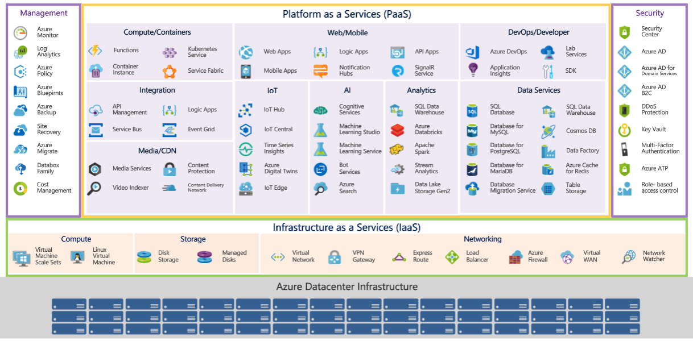

## Lernziele

## Cloud Modelle

## Cloud Formen

### Cloud Bursting zur Hybriden Cloud

## Merkmale der Cloud

**On-Demand Self Service**
Nutzer konnen die IT-Kapazitaten, die sie benotigen, selbstandg ordern und einrichte und das, wann immer sie wollen. So kann zum Beispiel Netwerkspeiche uber ein Portal bestellt werden.

> Vorteil: Der Anbieter muss in den Prozess nicht eingebunden werden.

**Broad Network Access**
Standardbasierter Netzzugriff von verschiedenen Endgeraten (z.B. Smartphones, Tablets, Notebooks, PCs) aus. Nutzer konnen ihre Arbeit unabhangig von Standort und Zeit erledigen.

**Resource Pooling**
Ressourcen des Anbieters (z.B. Speicher oder Bandbreite) werden gebundelt, multimandantenfahig beretgestell und nach Bedarf zugewiesen.

> Vorteil: Der Nutzer erhalt alle Ressourcen, inklusive Verwaltung, Business Continuity und technische Instandhaltung, ohne sich selbst aktiv darum kummern zU müssen.

**Rapid Elasticity**
Kapazitaten sind schnell und dynamisch verfugbar und konnen je nach Bedarf skaliert werden. Bei erhohtem Datenverkehr zum Bespiel konen Nutzer und automatisch uber zusatzliche Ressourcen verfugen. Gleichzeitig werden Resourcen und Investments verringert,
sobald die Anforderungen sinken.

**Measured Service**
automatische Kontrolle und Optimierung der genutzten Ressourcen durch Metering, was
Transparenz fur Anbieter und Nutzer sicherstellt. Großer Vorteil hier ist, dass Kunden nur die Dienstleistungen bezahlen, die sie auch tatsachlich in Anspruch nehmen.
